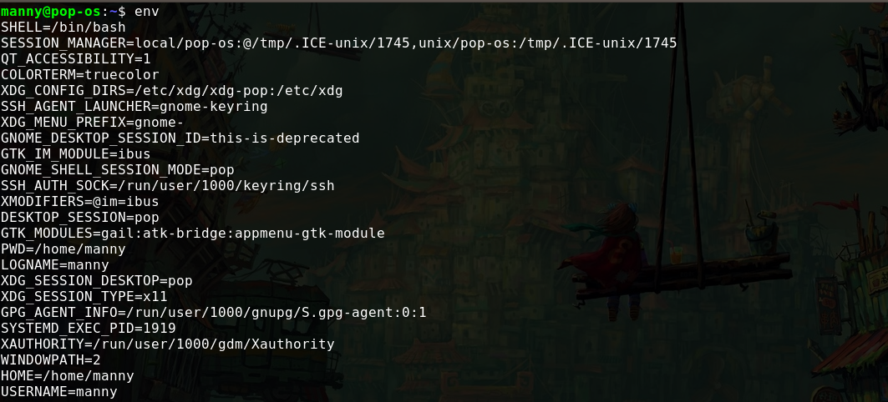
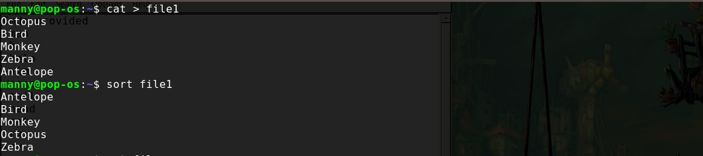
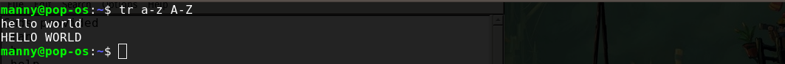
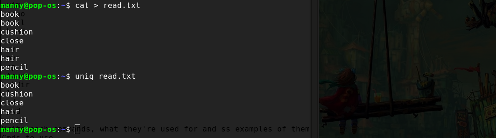
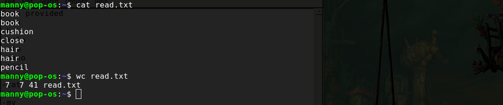
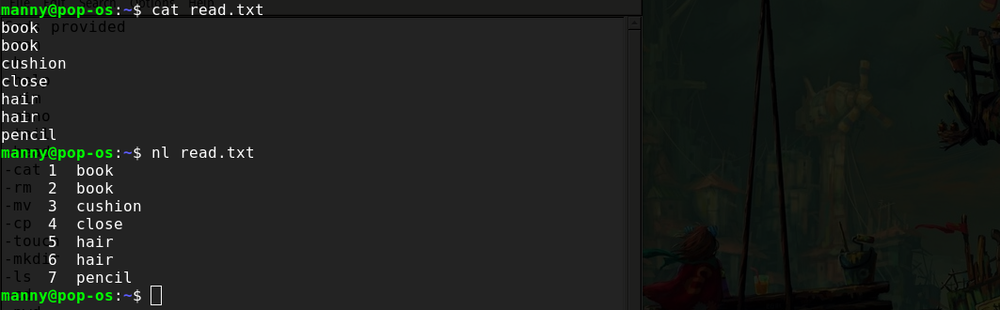
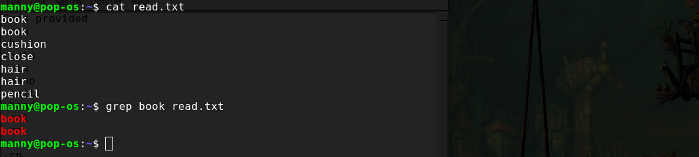
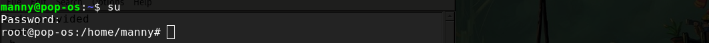
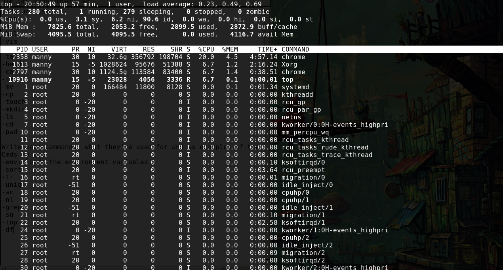
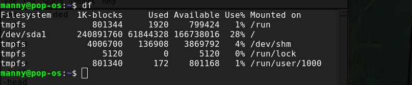

Here are 10 Linux CLI commands:  
1. env: This command outputs information about the environment variables set in your shell. You enter "env" in the terminal and click enter.  
  

2. sort: This command is useful for sorting lines in a file.  
  

3. tr: This allows you to translate one set of characters to another. Below I translate a set of lower case characters to uppercase.  
  

4. uniq: This command deletes duplicate words from a file.  
  

5. wc: This counts the words in a file in the format "no. of words| no. of lines |no. of bytes".  
  

6. nl: This numbers every line in a file starting from 1 till the number of the last line.  
  

7. grep: This lets you search out and isolate specific text patterns in a file.  
    

8. su: This allows you to switch users in the terminal. If no user is specified it switches to root by default. Below, I switch from manny to root user.  
    

9. top: This command outputs live information about the processes running on your system. Enter "top" in the terminal and you'll get something like this:  
  
exit "top" with the letter "q".

10. df: This shows the amount of disk space used and available on your system measured in bytes.  
  